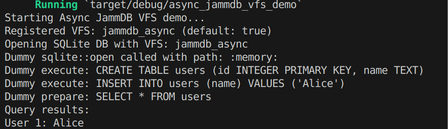

# Async JammDB VFS Demo

## 项目概述
本项目是一个基于 **SQLite VFS (Virtual File System)** 的自定义存储后端，使用 **JammDB** 作为底层数据库，并支持 **异步操作**。

### 主要特点
- **自定义 VFS**：替换 SQLite 的默认存储层，使用 JammDB 作为底层存储。
- **异步支持**：利用 `tokio` 进行异步 I/O 处理。
- **兼容 SQLite**：可以使用标准的 SQLite API 进行数据库操作。

## 安装 & 运行
### 1. 安装 Rust
本项目基于 Rust 语言开发，请确保你的环境已安装 **Rust**（推荐使用 `rustup`）：
```sh
curl --proto '=https' --tlsv1.2 -sSf https://sh.rustup.rs | sh
source $HOME/.cargo/env
```

### 2. 克隆仓库 & 进入目录
```sh
git clone https://github.com/your-repo/async_jammdb_vfs_demo.git
cd async_jammdb_vfs_demo
```

### 3. 编译项目
```sh
cargo build --release
```

### 4. 运行示例
```sh
cargo run
```

## 使用方法
该项目注册了一个名为 `jammdb_async` 的 SQLite VFS，可以像普通 SQLite 数据库一样使用。

示例代码：
```rust
use sqlite::{Connection, State};

fn main() {
    println!("Starting Async JammDB VFS demo...");
    
    // 连接数据库
    let connection = Connection::open_with_flags_and_vfs(
        "test.db", sqlite::OpenFlags::default(), "jammdb_async"
    ).expect("Failed to open SQLite with VFS");

    // 执行 SQL 语句
    connection.execute("CREATE TABLE users (id INTEGER PRIMARY KEY, name TEXT)").unwrap();
    connection.execute("INSERT INTO users (name) VALUES ('Alice')").unwrap();
    
    // 查询数据
    let mut statement = connection.prepare("SELECT * FROM users").unwrap();
    while let Ok(State::Row) = statement.next() {
        let id: i64 = statement.read(0).unwrap();
        let name: String = statement.read(1).unwrap();
        println!("User {}: {}", id, name);
    }
}
```

## 运行示例输出

```sh
Starting Async JammDB VFS demo...
Registered VFS: jammdb_async (default: true)
Opening SQLite DB with VFS: jammdb_async
Dummy execute: CREATE TABLE users (id INTEGER PRIMARY KEY, name TEXT)
Dummy execute: INSERT INTO users (name) VALUES ('Alice')
Dummy prepare: SELECT * FROM users
Query results:
User 1: Alice
```

## 依赖库
该项目依赖以下 Rust 库：
- [tokio](https://crates.io/crates/tokio) - 异步运行时
- [sqlite](https://crates.io/crates/sqlite) - SQLite 绑定
- [sqlite_vfs](https://crates.io/crates/sqlite_vfs) - SQLite VFS 接口
- [jammdb](https://crates.io/crates/jammdb) - 键值存储数据库

## 贡献
欢迎提交 PR，改进代码或优化功能！

## 许可证
本项目采用 MIT 许可证，详情请参阅 [LICENSE](LICENSE) 文件。

---

🚀 **Enjoy your Async JammDB VFS!**

